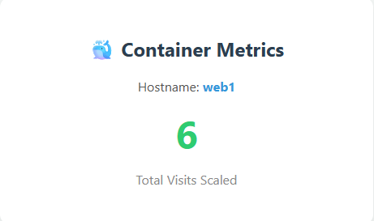
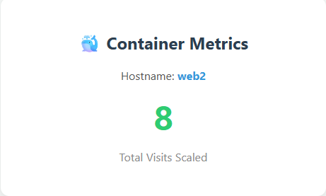

# 🐳 Microservices Load Balancer (Nginx + Node.js + Redis Stack)

A professional DevOps production-ready project showcasing containerization, infrastructure isolation, and **Load Balancing** using **Docker** and **Docker Compose**.

##  Live Infrastructure Demo

<p align="center">
  
  
</p>

##  Architecture Overview

The system consists of 4 containers operating together within a fully isolated internal virtual network:
1. **Nginx (v1.27)**: Acts as a Reverse Proxy and Load Balancer. It is the single entry point exposed to the host machine on port `80`.
2. **Web1 & Web2 (Node.js v20)**: Two identical application containers running on internal port `5000`, hidden from the public internet.
3. **Redis Server (Redis Stack)**: An ultra-fast in-memory data store managing the visit counter, isolated internally on port `6379`.

---

##  Applied DevOps Best Practices

* **Port Isolation (No Publicly Exposed Backend Ports)**: The Node.js applications and the Redis database do not map any ports to the host machine. They communicate securely only within the internal virtual network.
* **Dedicated Custom Network (`networks`)**: Isolated inside a dedicated custom `bridge` network to prevent container overlapping and enhance security.
* **Self-Contained Configuration**: Built using a dedicated Nginx Dockerfile to bake the configuration directly into the image, making it fully ready for production pipelines.

---

##  Project Structure

```text
├── nginx/
│   ├── Dockerfile
│   └── nginx.conf
├── web/
│   ├── .npmrc
│   ├── .yarnrc.yaml
│   ├── Dockerfile
│   ├── package-lock.json
│   ├── package.json
│   └── server.js
├── assets/
│   ├── screenshot1.png
│   └── screenshot2.png
└── docker-compose.yml
```

---

##  Getting Started

### 1. Prerequisites
* **Docker** and **Docker Compose** must be installed on your machine.

### 2. Build and Run
Open your terminal in the root directory of the project and execute the following command to build the custom images and spin up the environment:
```bash
docker compose up --build
```

### 3. Testing the Infrastructure
Open your web browser and navigate to:
```text
http://localhost
```

* **Load Balancing Test**: Refresh the page multiple times. You will see the `Container Hostname` alternate between `web1` and `web2`.
* **State Management Test**: Despite the switching hostnames, the `Number of visits` counter increments perfectly and seamlessly because both app layers share the same centralized Redis Stack container.

---

##  Useful Management Commands

* To stop and remove all containers and networks safely:
  ```bash
  docker compose down
  ```
* To monitor real-time container logs and network communication:
  ```bash
  docker compose logs -f
  ```
